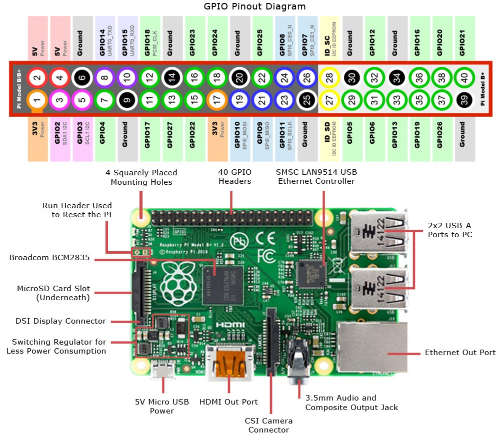
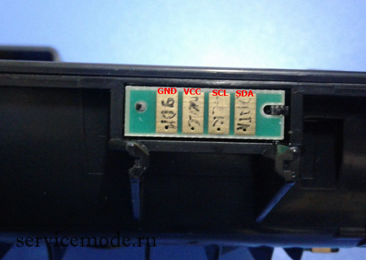

# Ricoh SP 150 сhip reseter

Позволяет сбросить флаг использованного тонера для картриджа принтеров SP 150.
Проект предназначен для выполнения на Rasperry Pi или других, имеющих доступ к шине I2C.

#### Инструкция по использованию

- Заливаем образ Raspbian lite, настраиваем сеть и т.п.
- Включаем поддержку I2C через raspi-config
- Устанавливаем дополнительные пакеты:

        apt-get install -y i2c-tools python-smbus
- Подключаем чип принтера к шине I2C:

|Raspberry GPIO |Пин Чипа (вырез справа) |
|---------------|------------------------|
|1 VCC          |2                       |
|3 SDA          |4                       |
|5 SCL          |3                       |
|9 Ground       |1                       |

- Проверяем правильность подключения и находим адрес чипа на шине:

        sudo it2detect -y 1
- Если все подключено правильно, то в выводе будет обнаружен адрес одного устройства (обычно это 0x53), запоминаем его
- Считываем данные с чипа:

        ./chip-reset.py --bus 1 0x53 dump >backup.dmp
        
- Обнуляем счетчик напечатанных страниц:

        ./chip-reset.py --bus 1 0x53 reset
- Если понадобилось восстановить дапм чипа:

        ./chip-reset.py --bus 1 0x53 restore <backup.dmp        
- Done.